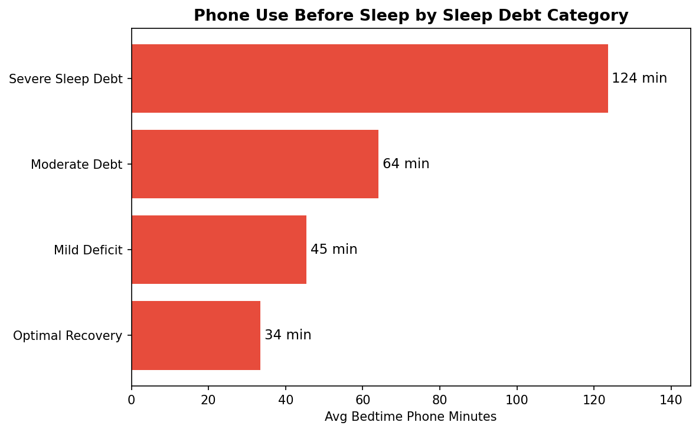
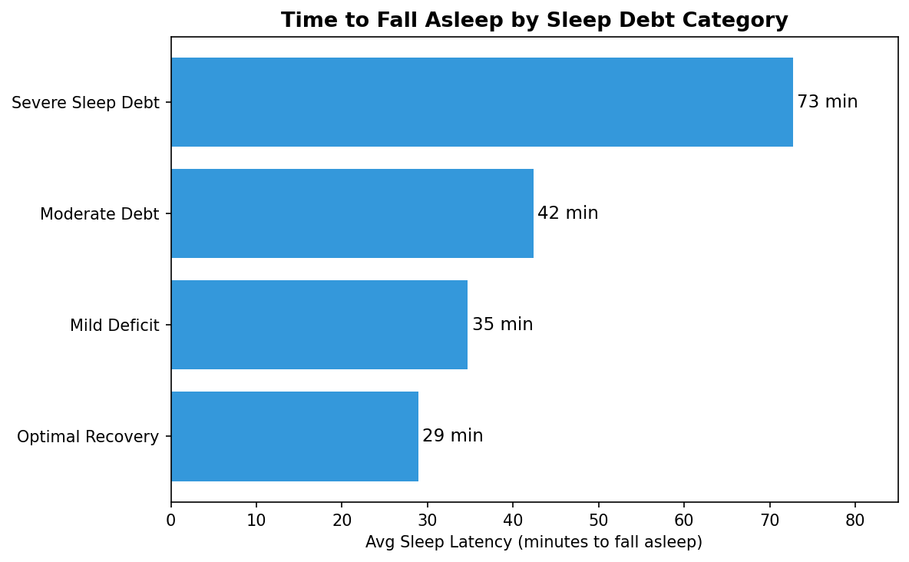
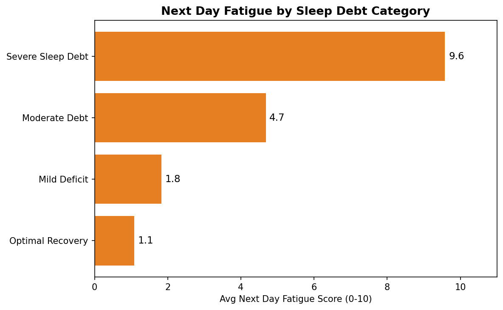

# Bedtime Screen Time and Sleep Debt Analysis

I picked this dataset because I wanted to understand something practical. Does scrolling your phone before bed actually matter, or is it just something people say? Turns out the numbers are pretty clear on this.

The dataset has 8,500 records collected from individuals tracking their evening habits, sleep patterns, and next-day energy levels. 18 columns in total, covering everything from what app they used before bed to how many times they hit snooze the next morning.

## Dataset Overview

- Source: Kaggle, Sleep Debt & Screen Time: Late Night Phone Habits
- 8,500 rows, 18 columns
- Zero missing values, zero duplicates
- Target column: sleep_debt_category (Optimal Recovery, Mild Deficit, Moderate Debt, Severe Sleep Debt)

## Approach

Instead of just plotting distributions, I focused on one question: what actually differs between someone with optimal sleep and someone with severe sleep debt?

I used groupby analysis on the target column and checked each behavioral feature one by one. Some things showed clear patterns. Others did not. For example, physical activity was almost identical across all four categories (34 to 36 minutes), so I did not make a chart for it. A finding of no difference is still a finding.

## Key Results

**Phone use before sleeping**
People with severe sleep debt averaged 124 minutes on their phone before bed. The optimal recovery group averaged 34 minutes. Across all four categories the pattern is completely consistent. More phone time, worse sleep outcome.

**Time to fall asleep**
The severe group took 73 minutes on average to fall asleep after getting into bed. The optimal group took 29 minutes. Even moderate debt pushed this up to 42 minutes.

**Next day fatigue**
This was the most striking result. Severe sleep debt group scored 9.6 out of 10 on next-day fatigue. Optimal recovery group scored 1.1. The gap between just these two numbers tells most of the story.

**Gender**
Checked this separately. Phone use and fatigue scores were nearly identical across male, female, and non-binary groups. No chart made for this.

## Tools

Python 3, pandas, matplotlib, seaborn
